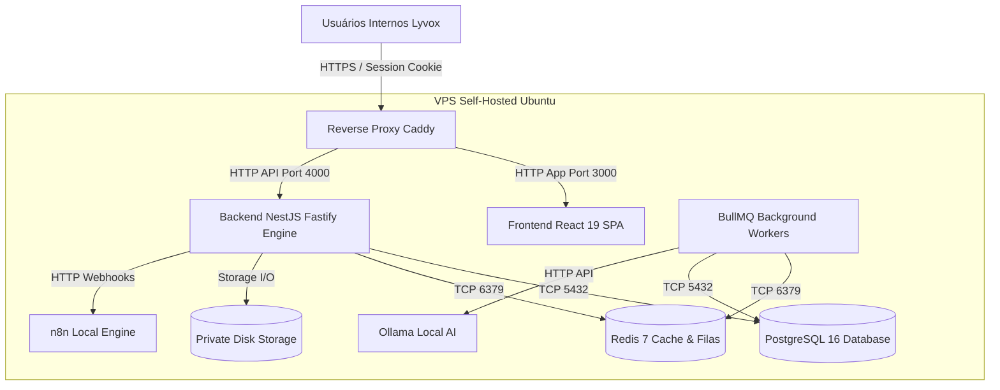
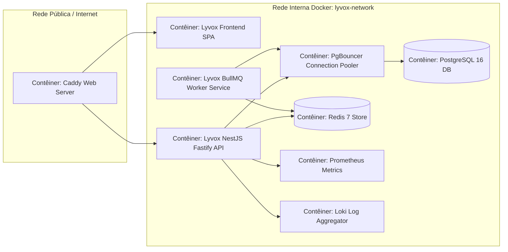

# 05 — Arquitetura Geral e Decisões de Stack

- **Documento ID:** DOC-05
- **Versão:** 2.0.0
- **Status:** APPROVED_FOR_CODEX_IMPLEMENTATION
- **Data:** 2026-07-21
- **Responsável:** Ottercraft (Chief Software Architect)
- **Classificação:** USER_APPROVED_FOR_PLANNING / ARCHITECTURAL_DECISION
- **Documentos Dependentes:** [01-VISAO-PRODUTO-ESCOPO-E-PRINCIPIOS.md](./01-VISAO-PRODUTO-ESCOPO-E-PRINCIPIOS.md), [02-REQUISITOS-FUNCIONAIS-E-REGRAS-DE-NEGOCIO.md](./02-REQUISITOS-FUNCIONAIS-E-REGRAS-DE-NEGOCIO.md)
- **Fontes Consultadas:** PROMPT-FINAL-UNICO-OTTERCRAFT, Documentação Oficial Node.js, Fastify, NestJS, React, PostgreSQL, Drizzle

---

## 1. Decisões Consolidadas de Stack e Tecnologias

A tabela a seguir apresenta as decisões técnicas definitivas para o **Lyvox Gerenciamento**. Cada escolha foi avaliada e congelada para a versão inicial do projeto.

| Camada | Tecnologia Selecionada | Opções Avaliadas | Justificativa Técnica Principal |
|---|---|---|---|
| **Estilo Arquitetural** | **Monólito Modular (Modulith)** | Microsserviços, Monólito Tradicional | Separação estrita de domínios sem o overhead de rede, latência e complexidade de microsserviços. |
| **Modelo Organizacional**| **Organização Única (Lyvox)** | Multi-Tenancy SaaS | Simplifica o MVP focado no uso interno da Lyvox. Evolução para SaaS registrada para o futuro. |
| **Monorepo & Gestão** | **pnpm Workspaces + Turborepo** | npm Workspaces, Nx, Lerna | Desempenho superior em caching, instalação ultrarrápida e controle estrito de dependências. |
| **Frontend Framework** | **React 19 + Vite + TypeScript** | Next.js, Vue, Angular | SPA de alta performance para sistemas internos, compilação instantânea e desacoplamento total da API. |
| **Backend Framework** | **NestJS (Fastify Adapter)** | Express, Fastify puro, Go | Estrutura modular opinativa em TypeScript com a performance e menor overhead do Fastify. |
| **Banco de Dados** | **PostgreSQL 16 (Self-hosted)** | Supabase, MySQL, MongoDB | Banco relacional robusto, suporte a JSONB, ACID, transações complexas e total autonomia. |
| **Acesso a Dados (ORM)** | **Drizzle ORM + PgBouncer** | Prisma, Kysely, TypeORM | Drizzle gera SQL previsível, sem overhead de binários pesados, 100% type-safe. |
| **Autenticação & Sessões** | **Sessões Opacas Server-Side** | Keycloak, JWT em LocalStorage | Cookie `HttpOnly, Secure, SameSite=Lax`. Sessão persistida no PostgreSQL com cache em Redis. |
| **Cache & Filas** | **Redis 7 + BullMQ** | RabbitMQ, Kafka | Redis para cache e rate limit; BullMQ para processamento assíncrono de jobs. |
| **Armazenamento (Storage)** | **Private Filesystem Volume** | MinIO, AWS S3 | Volume em disco na VPS (`/var/lib/lyvox/storage/`) com abstração para migração futura. |
| **Proxy / TLS** | **Caddy Server** | Nginx, Traefik | Automação nativa de TLS/HTTPS via ACME Let's Encrypt e baixíssimo consumo de memória. |
| **Orquestração VPS** | **Docker Compose v2 + systemd** | Kubernetes, Nomad, k3s | Operação direta em VPS única com janelas controladas de deploy e scripts de atualização. |
| **Observabilidade** | **Pino JSON + Prometheus + Grafana + Loki**| Datadog, New Relic, Tempo | Stack 100% open-source self-hosted para métricas, agregação de logs JSON e OpenTelemetry. |
| **Testes** | **Vitest + Playwright + k6** | Jest, Cypress | Vitest para testes de unidade/integração; Playwright para E2E; k6 para testes de carga. |

---

## 2. Diagramas Arquiteturais C4 Model

### 2.1 Diagrama de Contexto (C4 Level 1)

### 2.2 Diagrama de Contêineres e Serviços (C4 Level 2)

---

## 3. Declaração Obrigatória sobre Limitações de VPS Única

> [!CAUTION]
> **DECLARAÇÃO DE LIMITAÇÃO INFRAESTRUTURAL:**
> **ONE_VPS_IS_A_SINGLE_POINT_OF_FAILURE.**
> 
> Caso a máquina física (Host da VPS), a placa de rede do datacenter ou a infraestrutura do provedor sofram uma falha de hardware ou indisponibilidade total, o sistema **Lyvox Gerenciamento** ficará inoperante até que o provedor restabeleça o servidor físico ou seja acionado o **Runbook de Disaster Recovery (RTO 4h)** em uma nova VPS.
> 
> A arquitetura garante **Resiliência e Recuperabilidade Operacional de Processos** (restarts de contêineres, transações no PostgreSQL, backups offsite com pgBackRest), porém não garante Alta Disponibilidade física de 99.99% contra destruição do host físico.

---

## 4. Orçamento de Recursos e Memória RAM na VPS (RESOURCE_BUDGET)

Considerando a VPS de referência (16 vCPU / 62 GiB RAM / SSD NVMe), o orçamento de memória é divido em:
- **Reserva do Sistema Operacional & Page Cache:** 12 GiB
- **Consumo Total Planejado dos Serviços:** 41 GiB (Margem livre restante: ~9 GiB)

| Serviço Contêiner | RAM Reserva | RAM Limite | CPU Limite | Justificativa |
|---|---:|---:|---|---|
| **Ollama AI Engine** | 12 GiB | 20 GiB | 4.0 vCPU | Modelos de linguagem locais (`llama3` / `mistral`) |
| **Qdrant Vector DB (Existente)**| 1.5 GiB | 3.0 GiB | 1.0 vCPU | Armazenamento de vetores de busca |
| **n8n Workflow Engine (Existente)**| 1.5 GiB | 3.0 GiB | 1.0 vCPU | Orquestração de webhooks externos |
| **PostgreSQL 16 + PgBouncer** | 4.0 GiB | 6.0 GiB | 3.0 vCPU | Persistência mestre e pooler de conexões |
| **Redis 7 Store** | 0.5 GiB | 1.5 GiB | 1.0 vCPU | Cache de sessão, rate limit e BullMQ |
| **Backend NestJS Fastify** | 1.0 GiB | 2.0 GiB | 2.0 vCPU | Engine de API HTTP REST |
| **BullMQ Workers** | 1.0 GiB | 2.0 GiB | 1.5 vCPU | Workers assíncronos de segundo plano |
| **Frontend SPA + Caddy Proxy** | 0.2 GiB | 0.5 GiB | 0.5 vCPU | Servidor web estático e proxy TLS |
| **Observabilidade (Prometheus/Loki/Grafana)**| 1.0 GiB | 2.0 GiB | 1.0 vCPU | Coleta de logs JSON e métricas |
| **Processos Transitórios de Backup**| 0.5 GiB | 1.0 GiB | 1.0 vCPU | Operações pgBackRest e restic |
| **TOTAL DOS SERVIÇOS** | **23.2 GiB** | **41.0 GiB** | **16.0 vCPU** | **Operação dentro do orçamento da VPS** |
