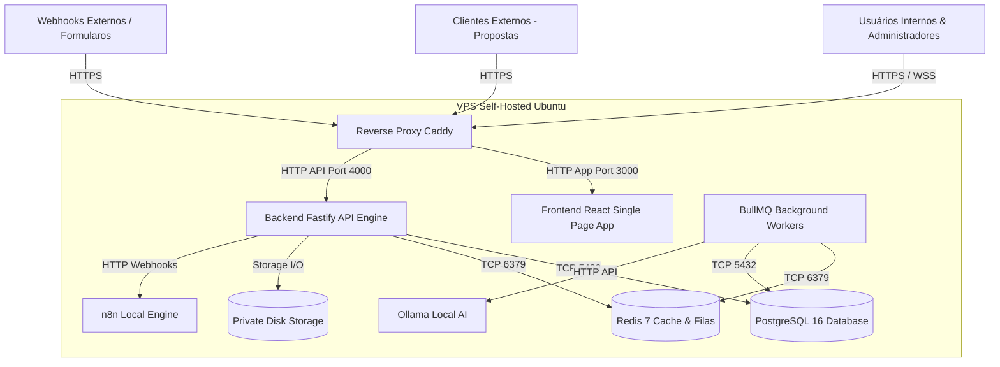
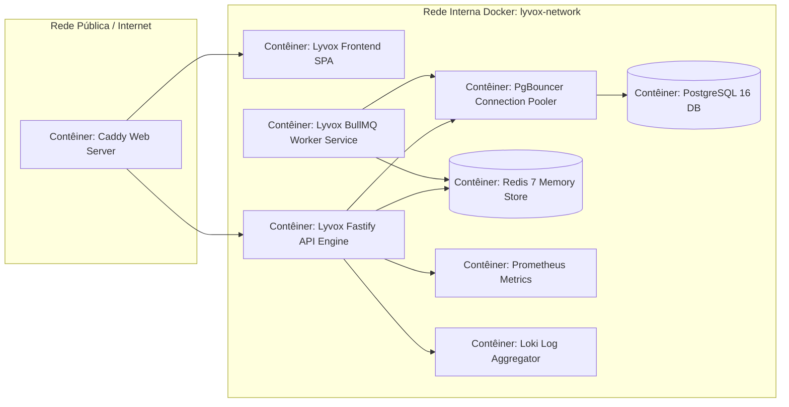
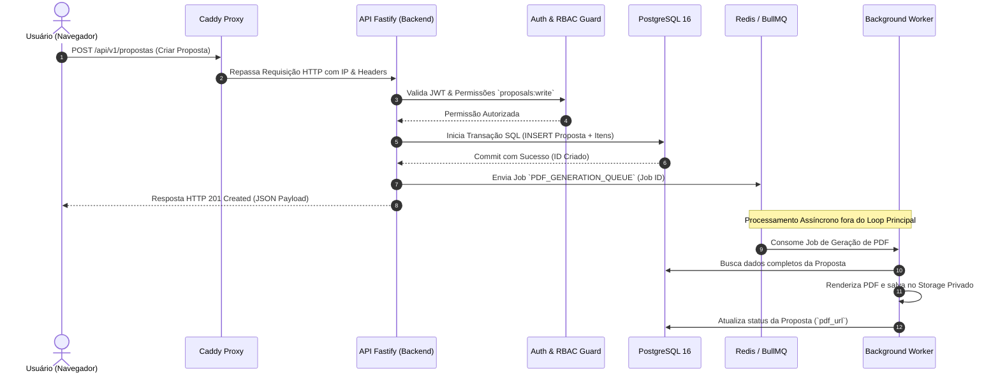

# 05 — Arquitetura Geral e Decisões de Stack

- **Documento ID:** DOC-05
- **Versão:** 1.0.0
- **Status:** APPROVED_BY_ARCHITECTURE_AGENT
- **Data:** 2026-07-21
- **Responsável:** Ottercraft (Chief Software Architect)
- **Classificação:** ARCHITECTURAL_DECISION / USER_CONFIRMED
- **Documentos Dependentes:** [01-VISAO-PRODUTO-ESCOPO-E-PRINCIPIOS.md](file:///c:/Users/pedro/OneDrive/Documentos/00-Projetos/19-%20lyvoxcorp/docs/planejamento/01-VISAO-PRODUTO-ESCOPO-E-PRINCIPIOS.md), [02-REQUISITOS-FUNCIONAIS-E-REGRAS-DE-NEGOCIO.md](file:///c:/Users/pedro/OneDrive/Documentos/00-Projetos/19-%20lyvoxcorp/docs/planejamento/02-REQUISITOS-FUNCIONAIS-E-REGRAS-DE-NEGOCIO.md)
- **Fontes Consultadas:** PROMPT-MESTRE-OTTERCRAFT, Documentação Oficial Node.js, Fastify, React, PostgreSQL, OpenTelemetry

---

## 1. Decisões Consolidadas de Stack e Tecnologias

A tabela a seguir apresenta as decisões técnicas definitivas para o **Lyvox Gerenciamento**. Cada escolha foi avaliada contra opções alternativas para maximizar performance, manutenibilidade, segurança e controle total de infraestrutura self-hosted.

| Camada | Tecnologia Selecionada | Opções Avaliadas | Justificativa Técnica Principal |
|---|---|---|---|
| **Estilo Arquitetural** | **Monólito Modular (Modulith)** | Microsserviços, Monólito Tradicional | Separação estrita de domínios sem o overhead de rede, latência e complexidade de microsserviços. |
| **Monorepo & Gestão** | **pnpm Workspaces + Turborepo** | npm Workspaces, Nx, Lerna | Desempenho superior em caching, instalação ultrarrápida e controle estrito de dependências. |
| **Frontend Framework** | **React 18/19 + Vite + TypeScript** | Next.js, Vue, Angular | SPA de altíssima performance para sistemas internos, compilação instantânea e ecossistema maduro. |
| **Backend Framework** | **Node.js 20 LTS + Fastify + TypeScript** | NestJS, Express, Go, Spring | Fastify possui menor overhead de memória e latência HTTP (~2x mais rápido que Express), com Zod nativo. |
| **Banco de Dados** | **PostgreSQL 16 (Self-hosted)** | Supabase, MySQL, MongoDB | Banco relacional robusto, suporte a JSONB, ACID, transações complexas e total autonomia. |
| **Acesso a Dados (ORM)** | **Drizzle ORM + PgBouncer** | Prisma, Kysely, TypeORM | Drizzle gera SQL previsível, sem overhead de binares pesados (diferente do Prisma), 100% type-safe. |
| **Autenticação & Sessões** | **Autenticação Própria (Argon2id + JWT)** | Keycloak, Ory, Auth0 | Elimina a necessidade de rodar contêineres pesados de IAM (Keycloak), total customização de RBAC. |
| **Cache & Filas** | **Redis 7 + BullMQ** | RabbitMQ, Kafka | Redis provê cache em memória de altíssima velocidade e BullMQ lida com filas e agendamento de jobs. |
| **Armazenamento (Storage)** | **Private Filesystem Volume / MinIO** | AWS S3, Supabase Storage | Volume em disco criptografado na VPS ou MinIO self-hosted para isolamento total de arquivos. |
| **Proxy / TLS** | **Caddy Server** | Nginx, Traefik | Automação nativa de TLS/HTTPS via Let's Encrypt, configuração simples e baixo consumo de memória. |
| **Orquestração VPS** | **Docker Compose v2 + systemd** | Kubernetes, Nomad, Swarm | Complexidade operacional mínima para VPS única, com restarts automáticos e redes isoladas. |
| **Observabilidade** | **OpenTelemetry + Prometheus + Grafana + Loki** | Datadog, New Relic | Stack 100% open-source self-hosted para métricas, traces distribuídos e agregação de logs JSON. |
| **Testes** | **Vitest + Playwright + k6** | Jest, Cypress | Vitest integra-se nativamente com Vite; Playwright garante testes E2E/UI rápidos; k6 para carga. |

---

## 2. Diagramas Arquiteturais C4 Model

### 2.1 Diagrama de Contexto (C4 Level 1)

### 2.2 Diagrama de Contêineres e Serviços (C4 Level 2)

---

## 3. Fluxo de Requisição HTTP Assíncrona e Transacional

---

## 4. Declaração Obrigatória sobre Limitações de VPS Única

> [!CAUTION]
> **DECLARAÇÃO DE LIMITAÇÃO INFRAESTRUTURAL:**
> **UMA VPS NÃO OFERECE ALTA DISPONIBILIDADE REAL DO HOST (PHYSICAL HIGH AVAILABILITY).**
> 
> Caso a máquina física (Host da VPS), a placa de rede do datacenter ou a infraestrutura do provedor sofram uma falha de hardware ou indisponibilidade total, o sistema **Lyvox Gerenciamento** ficará inoperante até que o provedor restabeleça o servidor físico.
> 
> A arquitetura especificada neste planejamento garante **Resiliência e Recuperabilidade Operacional de Processos** (restarts de contêineres, transações atômicas no PostgreSQL, filas no Redis, backups diários offsite), porém não garante Uptime de 99.99% contra falhas catastróficas do host físico de uma única VPS.

---

## 5. Orçamento e Capacidade Prevista da VPS

Considerando a VPS de referência (16 vCPU / 62 GB RAM / SSD NVMe), a alocação recomendada de recursos para os contêineres Docker é detalhada abaixo:

| Serviço Contêiner | vCPU Limite | RAM Reserva | RAM Limite | Armazenamento Estimado | Conexões Máximas |
|---|---:|---:|---:|---|---:|
| **Caddy Proxy** | 1.0 vCPU | 256 MB | 1 GB | 5 GB (Logs/Certs) | 5.000 HTTP/2 |
| **Frontend SPA** | 0.5 vCPU | 128 MB | 512 MB | 1 GB (Static Files) | N/A (Static) |
| **Backend Fastify API** | 4.0 vCPU | 2 GB | 8 GB | 10 GB (App Logs) | 500 Concorrentes |
| **BullMQ Worker Engine** | 2.0 vCPU | 1 GB | 4 GB | 5 GB | 50 Workers |
| **PgBouncer + PostgreSQL 16** | 4.0 vCPU | 8 GB | 24 GB | 200 GB NVMe | 1000 Pool / 100 DB |
| **Redis 7 Memory Store** | 1.0 vCPU | 2 GB | 6 GB | 20 GB (AOF Persistence) | 10.000 TCP |
| **n8n Workflow Engine** | 2.0 vCPU | 2 GB | 6 GB | 30 GB | Configrável |
| **Ollama AI Engine** | 4.0 vCPU | 8 GB | 16 GB | 50 GB (Models) | 5 Concorrentes |
| **Prometheus / Loki / Grafana** | 1.0 vCPU | 2 GB | 4 GB | 50 GB (Metrics/Logs) | N/A Internal |
| **TOTAL ALOCADO** | **19.5 vCPU (Overcommit)** | **26.38 GB** | **69.51 GB** | **371 GB NVMe** | — |

*Nota:* O uso de CPU e memória RAM suporta *overcommit* seguro devido ao pico de carga dos workers não coincidir simultaneamente com a requisição da API HTTP.
