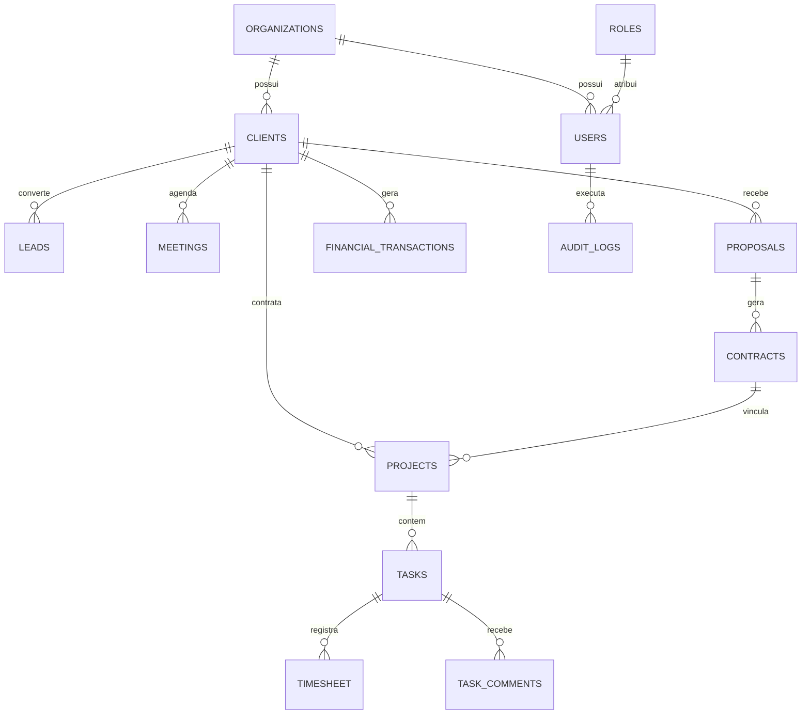

# 08 — Modelagem PostgreSQL e Dicionário de Dados

- **Documento ID:** DOC-08
- **Versão:** 1.0.0
- **Status:** APPROVED_BY_ARCHITECTURE_AGENT
- **Data:** 2026-07-21
- **Responsável:** Ottercraft (Data Architect & DBA)
- **Classificação:** ARCHITECTURAL_DECISION / USER_CONFIRMED
- **Documentos Dependentes:** [02-REQUISITOS-FUNCIONAIS-E-REGRAS-DE-NEGOCIO.md](file:///c:/Users/pedro/OneDrive/Documentos/00-Projetos/19-%20lyvoxcorp/docs/planejamento/02-REQUISITOS-FUNCIONAIS-E-REGRAS-DE-NEGOCIO.md), [07-ARQUITETURA-BACKEND.md](file:///c:/Users/pedro/OneDrive/Documentos/00-Projetos/19-%20lyvoxcorp/docs/planejamento/07-ARQUITETURA-BACKEND.md)
- **Fontes Consultadas:** PROMPT-MESTRE-OTTERCRAFT, PostgreSQL 16 Documentation, Drizzle ORM Guidelines

---

## 1. Visão Geral da Modelagem e Estratégia de Dados

A camada de persistência do **Lyvox Gerenciamento** utiliza o **PostgreSQL 16**. A modelagem foi concebida do zero (*Greenfield*), organizada sob o schema público ou schemas lógicos separados, suportando multi-tenancy corporativo através da coluna obrigatória `organization_id` em todas as tabelas transacionais.

---

## 2. Padrões Obrigatórios de Colunas em Tabelas Transacionais

Todas as tabelas do sistema (exceto tabelas de relacionamento puro N:M) devem incorporar o seguinte padrão base de colunas:

```sql
id              UUID PRIMARY KEY DEFAULT gen_random_uuid(),
organization_id UUID NOT NULL REFERENCES organizations(id),
created_at      TIMESTAMPTZ NOT NULL DEFAULT NOW(),
updated_at      TIMESTAMPTZ NOT NULL DEFAULT NOW(),
deleted_at      TIMESTAMPTZ NULL, -- Soft Delete
version         INTEGER NOT NULL DEFAULT 1, -- Optimistic Locking
created_by_id   UUID NULL REFERENCES users(id),
updated_by_id   UUID NULL REFERENCES users(id)
```

---

## 3. Diagrama Entidade-Relacionamento (ERD Principal)



---

## 4. Dicionário de Dados Detalhado (Tabelas Principais)

### 4.1 Tabela `organizations` (Empresas / Tenancy)
- **DB-ID:** DB-001 | **Módulo:** Configurações Globais
- **Objetivo:** Armazenar organizações/empresas cadastradas no sistema.

| Coluna | Tipo SQL | Constraints | Descrição / Regra |
|---|---|---|---|
| `id` | `UUID` | PK, NOT NULL | Identificador único |
| `name` | `VARCHAR(255)` | NOT NULL | Razão Social ou Nome da Empresa |
| `trade_name` | `VARCHAR(255)` | NULL | Nome Fantasia |
| `document` | `VARCHAR(20)` | UNIQUE, NOT NULL | CNPJ ou documento fiscal |
| `created_at` | `TIMESTAMPTZ` | NOT NULL | Data de criação |

### 4.2 Tabela `users` (Usuários do Sistema)
- **DB-ID:** DB-002 | **Módulo:** Identidade & Acesso
- **Objetivo:** Armazenar dados de autenticação e perfil dos usuários.

| Coluna | Tipo SQL | Constraints | Descrição / Regra |
|---|---|---|---|
| `id` | `UUID` | PK, NOT NULL | Identificador único |
| `organization_id` | `UUID` | FK (organizations.id), NOT NULL | Vínculo com a Organização |
| `role_id` | `UUID` | FK (roles.id), NOT NULL | Cargo / Perfil RBAC |
| `email` | `VARCHAR(255)` | UNIQUE, NOT NULL | E-mail corporativo de login |
| `password_hash` | `TEXT` | NOT NULL | Hash da senha gerado via Argon2id |
| `full_name` | `VARCHAR(255)` | NOT NULL | Nome completo |
| `mfa_enabled` | `BOOLEAN` | DEFAULT false, NOT NULL | Status de ativação do MFA TOTP |
| `mfa_secret` | `TEXT` | NULL | Segredo TOTP criptografado |
| `status` | `VARCHAR(20)` | DEFAULT 'ACTIVE', NOT NULL | Status: ACTIVE, SUSPENDED, BLOCKED |
| `deleted_at` | `TIMESTAMPTZ` | NULL | Timestamp para soft delete |

### 4.3 Tabela `clients` (Clientes)
- **DB-ID:** DB-020 | **Módulo:** Clientes
- **Objetivo:** Cadastro centralizado de clientes (PF/PJ).

| Coluna | Tipo SQL | Constraints | Descrição / Regra |
|---|---|---|---|
| `id` | `UUID` | PK, NOT NULL | Identificador do cliente |
| `organization_id` | `UUID` | FK, NOT NULL | Organização proprietária |
| `type` | `VARCHAR(10)` | NOT NULL | Tipo: 'PJ' (Pessoa Jurídica) ou 'PF' |
| `name` | `VARCHAR(255)` | NOT NULL | Nome ou Razão Social |
| `document` | `VARCHAR(20)` | NOT NULL | CPF ou CNPJ |
| `email` | `VARCHAR(255)` | NOT NULL | E-mail principal de contato |
| `phone` | `VARCHAR(20)` | NULL | Telefone / WhatsApp |
| `status` | `VARCHAR(20)` | DEFAULT 'ACTIVE', NOT NULL | Status: ACTIVE, INACTIVE, CHURNED |
| `deleted_at` | `TIMESTAMPTZ` | NULL | Timestamp para soft delete |

### 4.4 Tabela `financial_transactions` (Lançamentos Financeiros)
- **DB-ID:** DB-080 | **Módulo:** Financeiro
- **Objetivo:** Registrar contas a pagar e contas a receber.

| Coluna | Tipo SQL | Constraints | Descrição / Regra |
|---|---|---|---|
| `id` | `UUID` | PK, NOT NULL | Identificador do lançamento |
| `organization_id` | `UUID` | FK, NOT NULL | Organização proprietária |
| `client_id` | `UUID` | FK (clients.id), NULL | Cliente associado (para receitas) |
| `type` | `VARCHAR(10)` | NOT NULL | Tipo: 'INCOME' (Receita) ou 'EXPENSE' (Despesa) |
| `amount` | `NUMERIC(15,2)` | CHECK (amount > 0), NOT NULL | Valor do lançamento em BRL |
| `due_date` | `DATE` | NOT NULL | Data de Vencimento |
| `payment_date` | `DATE` | NULL | Data Real do Pagamento |
| `status` | `VARCHAR(20)` | DEFAULT 'PENDING', NOT NULL | Status: PENDING, PAID, OVERDUE, CANCELLED |
| `version` | `INTEGER` | DEFAULT 1, NOT NULL | Trava de concorrência otimista |

### 4.5 Tabela `outbox_events` (Padrão Transactional Outbox)
- **DB-ID:** DB-100 | **Módulo:** Automações & Eventos
- **Objetivo:** Garantir a publicação confiável de eventos assíncronos (n8n / Webhooks / Filas) dentro da mesma transação do banco.

| Coluna | Tipo SQL | Constraints | Descrição / Regra |
|---|---|---|---|
| `id` | `UUID` | PK, NOT NULL | Identificador do evento |
| `aggregate_type` | `VARCHAR(100)` | NOT NULL | Tipo do Agregado (ex: 'PROPOSAL', 'CLIENT') |
| `aggregate_id` | `UUID` | NOT NULL | ID do registro afetado |
| `event_type` | `VARCHAR(100)` | NOT NULL | Nome do evento (ex: 'ProposalApproved') |
| `payload` | `JSONB` | NOT NULL | Dados completos do evento em formato JSON |
| `processed` | `BOOLEAN` | DEFAULT false, NOT NULL | Flag de envio concluído pelo worker |
| `created_at` | `TIMESTAMPTZ` | DEFAULT NOW(), NOT NULL | Data do registro transacional |

---

## 5. Estratégia de Índices e Performance no PostgreSQL

- **Índices Comportamentais Multi-Tenancy:** Todas as tabelas possuem índice composto cobrindo `(organization_id, id)` e `(organization_id, status)`.
- **Índices Parciais para Soft Delete:** Para otimizar consultas que ignoram registros excluídos:
  ```sql
  CREATE INDEX idx_clients_org_active ON clients (organization_id, name) WHERE deleted_at IS NULL;
  ```
- **Busca Textual Avançada (Trigram Indexing):** Utilização da extensão `pg_trgm` para busca rápida por substrings em nomes e e-mails:
  ```sql
  CREATE INDEX idx_clients_name_trgm ON clients USING gin (name gin_trgm_ops);
  ```

---

## 6. Política de Migrations e Versionamento de Banco

1. **Ferramenta de Migration:** **Drizzle Kit** integrado ao repositório backend.
2. **Nomenclatura de Arquivos:** `<TIMESTAMP>_<NOME_DESCRITIVO>.sql` (ex: `0001_create_initial_schema.sql`).
3. **Imutabilidade e Rollback:** Migrations executadas em produção são estritamente incrementais. Alterações destrutivas seguem o padrão *Expand and Contract* (adicionar nova coluna -> migrar dados -> remover coluna antiga em release futura).
