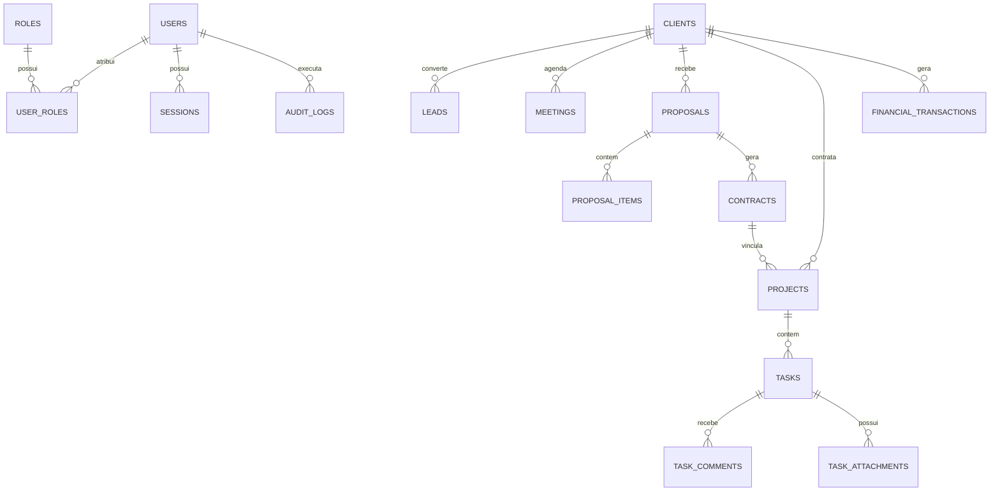

# 08 — Modelagem PostgreSQL e Dicionário de Dados

- **Documento ID:** DOC-08
- **Versão:** 2.0.0
- **Status:** APPROVED_FOR_CODEX_IMPLEMENTATION
- **Data:** 2026-07-21
- **Responsável:** Ottercraft (Data Architect & DBA)
- **Classificação:** USER_APPROVED_FOR_PLANNING / ARCHITECTURAL_DECISION
- **Documentos Dependentes:** [02-REQUISITOS-FUNCIONAIS-E-REGRAS-DE-NEGOCIO.md](./02-REQUISITOS-FUNCIONAIS-E-REGRAS-DE-NEGOCIO.md), [07-ARQUITETURA-BACKEND.md](./07-ARQUITETURA-BACKEND.md)
- **Fontes Consultadas:** PROMPT-FINAL-UNICO-OTTERCRAFT, PostgreSQL 16 Documentation, Drizzle ORM Guidelines

---

## 1. Visão Geral da Modelagem e Estratégia de Dados

A camada de persistência do **Lyvox Gerenciamento** utiliza o **PostgreSQL 16**. A modelagem foi concebida do zero (*Greenfield*), organizada no schema público com tabelas de domínio bem definidas.

---

## 2. Padrões Obrigatórios de Colunas em Tabelas Transacionais

Todas as tabelas do sistema (exceto tabelas de relacionamento puro N:M) incorporam o seguinte padrão base de colunas:

```sql
id              UUID PRIMARY KEY DEFAULT gen_random_uuid(),
created_at      TIMESTAMPTZ NOT NULL DEFAULT NOW(),
updated_at      TIMESTAMPTZ NOT NULL DEFAULT NOW(),
deleted_at      TIMESTAMPTZ NULL, -- Soft Delete
version         INTEGER NOT NULL DEFAULT 1, -- Optimistic Locking
created_by_id   UUID NULL REFERENCES users(id),
updated_by_id   UUID NULL REFERENCES users(id)
```

---

## 3. Diagrama Entidade-Relacionamento (ERD Principal)



---

## 4. Dicionário de Dados Detalhado (Tabelas Mapeadas)

### 4.1 Tabela `users` (Usuários do Sistema)
- **DB-ID:** DB-001 | **Módulo:** Identidade & Acesso
- **Objetivo:** Cadastro central de usuários da Lyvox.

| Coluna | Tipo SQL | Constraints | Descrição / Regra |
|---|---|---|---|
| `id` | `UUID` | PK, NOT NULL | Identificador único |
| `email` | `VARCHAR(255)` | UNIQUE, NOT NULL | E-mail corporativo de login |
| `full_name` | `VARCHAR(255)` | NOT NULL | Nome completo |
| `status` | `VARCHAR(20)` | DEFAULT 'ACTIVE', NOT NULL | Status: ACTIVE, SUSPENDED, BLOCKED |
| `created_at` | `TIMESTAMPTZ` | NOT NULL | Timestamp de criação |
| `deleted_at` | `TIMESTAMPTZ` | NULL | Soft delete |

### 4.2 Tabela `password_credentials` (Credenciais de Senha)
- **DB-ID:** DB-002 | **Módulo:** Identidade & Acesso
- **Objetivo:** Armazenar hash de senha separado da tabela de usuários.

| Coluna | Tipo SQL | Constraints | Descrição / Regra |
|---|---|---|---|
| `id` | `UUID` | PK, NOT NULL | Identificador único |
| `user_id` | `UUID` | FK (users.id), UNIQUE, NOT NULL | Vínculo com o usuário |
| `password_hash` | `TEXT` | NOT NULL | Hash Argon2id |
| `updated_at` | `TIMESTAMPTZ` | NOT NULL | Data da última alteração de senha |

### 4.3 Tabela `sessions` (Sessões Opacas Server-Side)
- **DB-ID:** DB-003 | **Módulo:** Identidade & Acesso
- **Objetivo:** Fonte de verdade para sessões ativas do sistema.

| Coluna | Tipo SQL | Constraints | Descrição / Regra |
|---|---|---|---|
| `id` | `UUID` | PK, NOT NULL | Identificador único |
| `user_id` | `UUID` | FK (users.id), NOT NULL | Usuário dono da sessão |
| `token_hash` | `VARCHAR(64)` | UNIQUE, NOT NULL | Hash SHA-256 do token opaco |
| `ip_address` | `VARCHAR(45)` | NOT NULL | IP de origem da sessão |
| `user_agent` | `TEXT` | NOT NULL | User Agent do navegador |
| `expires_at` | `TIMESTAMPTZ` | NOT NULL | Data de expiração da sessão |
| `revoked_at` | `TIMESTAMPTZ` | NULL | Data de revogação manual/logout |

### 4.4 Tabela `roles` e `permissions` (RBAC)
- **DB-ID:** DB-004, DB-005 | **Módulo:** Identidade & Acesso
- **Objetivo:** Perfis e permissões granulares no formato `recurso.ação`.

### 4.5 Tabela `clients` (Clientes)
- **DB-ID:** DB-020 | **Módulo:** Clientes
- **Objetivo:** Cadastro centralizado de clientes (PF/PJ).

| Coluna | Tipo SQL | Constraints | Descrição / Regra |
|---|---|---|---|
| `id` | `UUID` | PK, NOT NULL | Identificador do cliente |
| `type` | `VARCHAR(10)` | NOT NULL | Tipo: 'PJ' ou 'PF' |
| `name` | `VARCHAR(255)` | NOT NULL | Nome ou Razão Social |
| `document` | `VARCHAR(20)` | NOT NULL | CPF ou CNPJ (validado) |
| `email` | `VARCHAR(255)` | NOT NULL | E-mail principal de contato |
| `status` | `VARCHAR(20)` | DEFAULT 'ACTIVE', NOT NULL | Status: ACTIVE, INACTIVE, CHURNED |
| `deleted_at` | `TIMESTAMPTZ` | NULL | Soft delete |

### 4.6 Tabela `financial_transactions` (Lançamentos Financeiros)
- **DB-ID:** DB-080 | **Módulo:** Financeiro
- **Objetivo:** Registrar contas a pagar e contas a receber.

| Coluna | Tipo SQL | Constraints | Descrição / Regra |
|---|---|---|---|
| `id` | `UUID` | PK, NOT NULL | Identificador do lançamento |
| `client_id` | `UUID` | FK (clients.id), NULL | Cliente associado (para receitas) |
| `type` | `VARCHAR(10)` | NOT NULL | Tipo: 'INCOME' ou 'EXPENSE' |
| `amount` | `NUMERIC(15,2)` | CHECK (amount > 0), NOT NULL | Valor do lançamento em BRL |
| `due_date` | `DATE` | NOT NULL | Data de Vencimento |
| `payment_date` | `DATE` | NULL | Data Real do Pagamento |
| `status` | `VARCHAR(20)` | DEFAULT 'PENDING', NOT NULL | Status: PENDING, PAID, OVERDUE, CANCELLED |
| `version` | `INTEGER` | DEFAULT 1, NOT NULL | Optimistic locking |

### 4.7 Tabela `outbox_events` (Padrão Transactional Outbox)
- **DB-ID:** DB-100 | **Módulo:** Automações & Eventos
- **Objetivo:** Publicação confiável de eventos assíncronos (n8n / Filas) na mesma transação.

| Coluna | Tipo SQL | Constraints | Descrição / Regra |
|---|---|---|---|
| `id` | `UUID` | PK, NOT NULL | Identificador do evento |
| `aggregate_type` | `VARCHAR(100)` | NOT NULL | Tipo do Agregado ('PROPOSAL', 'CLIENT') |
| `aggregate_id` | `UUID` | NOT NULL | ID do registro afetado |
| `event_type` | `VARCHAR(100)` | NOT NULL | Nome do evento ('ProposalApproved') |
| `payload` | `JSONB` | NOT NULL | Dados em formato JSON |
| `processed` | `BOOLEAN` | DEFAULT false, NOT NULL | Flag de envio concluído |

---

## 5. Estratégia de Índices e Performance no PostgreSQL

- **Índices Comportamentais:** Tabelas possuem índice composto em `(status, created_at)` e `(deleted_at)`.
- **Índices Parciais para Soft Delete:**
  ```sql
  CREATE INDEX idx_clients_active ON clients (name) WHERE deleted_at IS NULL;
  ```
- **Busca Textual por Substring:** Extensão `pg_trgm` para busca rápida por nomes e e-mails:
  ```sql
  CREATE INDEX idx_clients_name_trgm ON clients USING gin (name gin_trgm_ops);
  ```

---

## 6. Política de Migrations e Versionamento de Banco

1. **Ferramenta de Migration:** **Drizzle Kit** no repositório backend.
2. **Nomenclatura:** `<TIMESTAMP>_<NOME_DESCRITIVO>.sql` (ex: `0001_initial_schema.sql`).
3. **Padrão Expand & Contract:** Alterações de esquema em produção são incrementais e sem quebra de indisponibilidade.
