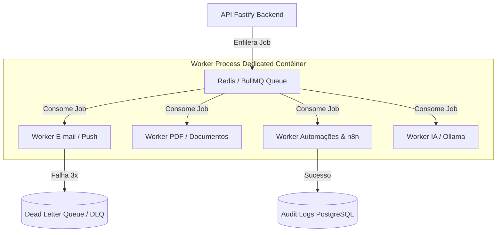

# 11 — Cache, Filas, Workers e Jobs

- **Documento ID:** DOC-11
- **Versão:** 1.0.0
- **Status:** APPROVED_BY_ARCHITECTURE_AGENT
- **Data:** 2026-07-21
- **Responsável:** Ottercraft (Systems & Distributed Operations Architect)
- **Classificação:** ARCHITECTURAL_DECISION / USER_CONFIRMED
- **Documentos Dependentes:** [05-ARQUITETURA-GERAL-E-DECISOES-DE-STACK.md](file:///c:/Users/pedro/OneDrive/Documentos/00-Projetos/19-%20lyvoxcorp/docs/planejamento/05-ARQUITETURA-GERAL-E-DECISOES-DE-STACK.md), [07-ARQUITETURA-BACKEND.md](file:///c:/Users/pedro/OneDrive/Documentos/00-Projetos/19-%20lyvoxcorp/docs/planejamento/07-ARQUITETURA-BACKEND.md)
- **Fontes Consultadas:** PROMPT-MESTRE-OTTERCRAFT, BullMQ Official Documentation, Redis Enterprise Patterns

---

## 1. Visão Geral da Camada de Cache e Processamento Assíncrono

O **Lyvox Gerenciamento** utiliza o **Redis 7** como infraestrutura unificada para armazenamento temporário em memória (Cache), controle de taxa de requisições (Rate Limiting), travas distribuídas (*Distributed Mutex Locks*) e gerenciamento de filas assíncronas de trabalho (*Background Jobs*) com **BullMQ**.

---

## 2. Estratégia de Caching e Invalidação

### 2.1 Padronização de Nomenclatura de Keys Redis
Todas as chaves salvas no Redis devem seguir o padrão hierárquico delimitado por dois pontos:

```text
lyvox:<ambiente>:<modulo>:<organizacao_id>:<entidade>:<identificador>
```

Exemplos:
- `lyvox:prod:dashboard:a1b2c3d4:kpis` (Cache de KPIs do Dashboard, TTL: 60s)
- `lyvox:prod:auth:users:e81d7632:session` (Sessão de usuário, TTL: 7 dias)
- `lyvox:prod:lock:financial:invoice:9988` (Trava distribuída de concorrência)

### 2.2 Política de TTL e Invalidação
1. **Cache de Consultas Frequentes (KPIs / Listagens):** TTL curto de 30 a 60 segundos com invalidação por *Cache Tags* ou invalidação ativa nas mutações (POST/PUT/DELETE) da entidade correspondente.
2. **Proteção contra Cache Stampede (Dogpiling):** Utilização de travas distribuídas via `redlock` para garantir que apenas um worker/processo recalcule a consulta em caso de expiração concorrente.

---

## 3. Arquitetura de Filas e Workers (BullMQ Engine)

Os processamentos demorados (geração de documentos PDF, envio de e-mails, retries de webhooks n8n, transcrição de áudios via IA e exportações) são obrigatoriamente desacoplados do ciclo de vida da requisição HTTP Fastify.



---

## 4. Tabela de Mapeamento de Background Jobs (JOB-ID)

| JOB-ID | Fila BullMQ | Produtor (Trigger) | Consumidor (Worker) | Timeout | Max Retries | Strategy | DLQ Enabled |
|---|---|---|---|---:|---:|---|:---:|
| **JOB-001** | `email_queue` | API / Automações | `EmailWorker` | 30s | 5 | Exponential Backoff | Sim |
| **JOB-002** | `pdf_queue` | Propostas / Contratos | `PdfGeneratorWorker` | 60s | 3 | Fixed Backoff (10s) | Sim |
| **JOB-003** | `n8n_outbox_queue` | Outbox Engine | `N8nWebhookWorker` | 15s | 5 | Exponential Backoff | Sim |
| **JOB-004** | `ai_transcription_queue` | Reuniões | `OllamaAudioWorker` | 300s | 2 | Manual Retry | Sim |
| **JOB-005** | `financial_recurring_queue`| Cron Scheduler | `RecurringInvoiceWorker`| 120s | 3 | Linear Backoff | Sim |
| **JOB-006** | `audit_export_queue` | Relatórios | `AuditExportWorker` | 180s | 2 | No Retry | Sim |

---

## 5. Idempotência e Tratamento de Falhas (DLQ)

1. **Chave de Idempotência do Job:** Todo job possui um identificador único de de-duplicação no BullMQ (`jobId = "pdf:proposal:" + proposalId`). Isso impede que o mesmo PDF seja gerado 2 vezes simultaneamente se o usuário clicar duas vezes no botão de geração.
2. **Dead Letter Queue (DLQ):** Jobs que falharem após o estouro do limite máximo de tentativas (`Max Retries`) são automaticamente transferidos para a fila de erro `lyvox:dlq:<queue_name>`. O dashboard operacional Bull-Board permite a inspeção do stack trace de falha e o re-disparo manual (*replay*) do job corrigido.
