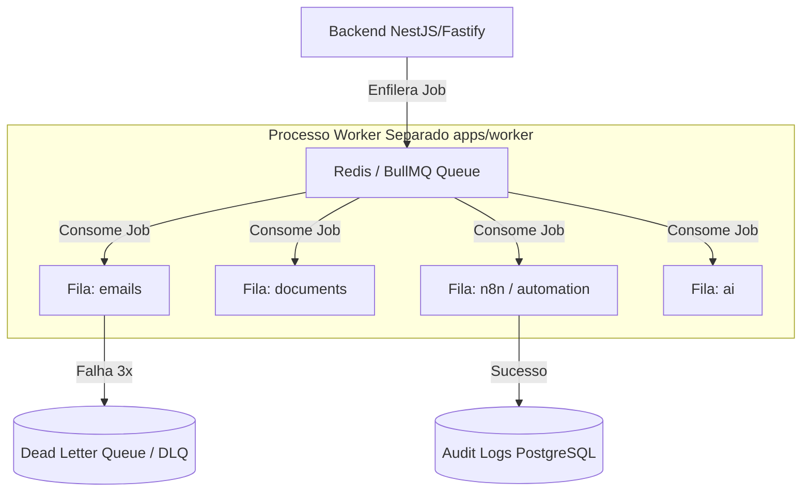

# 11 — Cache, Filas, Workers e Jobs

- **Documento ID:** DOC-11
- **Versão:** 2.0.0
- **Status:** APPROVED_FOR_CODEX_IMPLEMENTATION
- **Data:** 2026-07-21
- **Responsável:** Ottercraft (Systems & Distributed Operations Architect)
- **Classificação:** USER_APPROVED_FOR_PLANNING / ARCHITECTURAL_DECISION
- **Documentos Dependentes:** [05-ARQUITETURA-GERAL-E-DECISOES-DE-STACK.md](./05-ARQUITETURA-GERAL-E-DECISOES-DE-STACK.md), [07-ARQUITETURA-BACKEND.md](./07-ARQUITETURA-BACKEND.md)
- **Fontes Consultadas:** PROMPT-FINAL-UNICO-OTTERCRAFT, BullMQ Official Documentation, Redis Enterprise Patterns

---

## 1. Visão Geral da Camada de Cache e Processamento Assíncrono

O **Lyvox Gerenciamento** utiliza o **Redis 7** como infraestrutura em memória para cache temporário, controle de taxa de requisições (Rate Limiting), travas distribuídas curtas (*Mutex Locks*) e suporte ao motor de filas assíncronas **BullMQ**.

> [!IMPORTANT]
> **REDIS NÃO É FONTE DA VERDADE:**
> Toda a persistência definitiva de sessões, dados e configurações reside no PostgreSQL. Se o Redis estiver temporariamente indisponível:
> - As consultas principais do banco continuam normalmente.
> - A autenticação de sessões ativas utiliza o PostgreSQL como fallback.
> - Os jobs assíncronos e automações ficam temporariamente pausados até o restabelecimento do Redis.

---

## 2. Estratégia de Caching e Invalidação

### 2.1 Padronização de Keys Redis
```text
lyvox:<ambiente>:<modulo>:<entidade>:<identificador>
```

Exemplos:
- `lyvox:prod:dashboard:kpis` (Cache de KPIs do Dashboard, TTL: 60s)
- `lyvox:prod:auth:session:e81d7632` (Cache de sessão de usuário, TTL: 7 dias)
- `lyvox:prod:lock:financial:invoice:9988` (Trava curta distribuída)

### 2.2 Política de TTL e Invalidação
1. **Cache de Consultas Frequentes (KPIs / Listagens):** TTL curto (30s a 60s) com invalidação ativa nas mutações (POST/PUT/DELETE) da entidade correspondente.
2. **Proteção contra Stampede:** Uso de travas distribuídas para garantir que apenas 1 worker recalcule a consulta expirada.

---

## 3. Arquitetura de Filas e Workers (`apps/worker/`)

Os processamentos demorados (geração de PDFs, e-mails, retries de webhooks n8n, transcrição de áudios via IA e relatórios) são executados em um processo separado de worker (`apps/worker/`).



---

## 4. Tabela de Mapeamento de Background Jobs (JOB-ID)

| JOB-ID | Fila BullMQ | Produtor (Trigger) | Consumidor (Worker) | Timeout | Max Retries | Strategy | DLQ Enabled |
|---|---|---|---|---:|---:|---|:---:|
| **JOB-001** | `emails` | API / Automações | `EmailWorker` | 30s | 5 | Exponential Backoff | Sim |
| **JOB-002** | `documents` | Propostas / Contratos | `PdfGeneratorWorker` | 60s | 3 | Fixed Backoff (10s) | Sim |
| **JOB-003** | `n8n` | Outbox Engine | `N8nWebhookWorker` | 15s | 5 | Exponential Backoff | Sim |
| **JOB-004** | `ai` | Reuniões | `OllamaAudioWorker` | 300s | 2 | Manual Retry | Sim |
| **JOB-005** | `automation` | Cron Scheduler | `RecurringInvoiceWorker`| 120s | 3 | Linear Backoff | Sim |
| **JOB-006** | `reports` | Relatórios | `AuditExportWorker` | 180s | 2 | No Retry | Sim |

---

## 5. Idempotência e Tratamento de Falhas (DLQ)

1. **Idempotência:** Todo job possui um identificador único de de-duplicação (`jobId = "pdf:proposal:" + proposalId`).
2. **Dead Letter Queue (DLQ):** Jobs que falharem após o estouro do limite máximo de tentativas (`Max Retries`) são transferidos para a fila de erro `lyvox:dlq:<queue_name>`, permitindo inspeção e re-disparo (*replay*).
