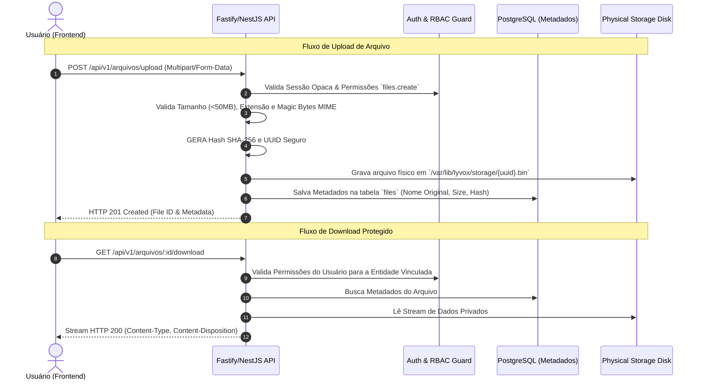

# 12 — Arquivos, Documentos e Storage

- **Documento ID:** DOC-12
- **Versão:** 2.0.0
- **Status:** APPROVED_FOR_CODEX_IMPLEMENTATION
- **Data:** 2026-07-21
- **Responsável:** Ottercraft (Storage & Data Security Architect)
- **Classificação:** USER_APPROVED_FOR_PLANNING / ARCHITECTURAL_DECISION
- **Documentos Dependentes:** [05-ARQUITETURA-GERAL-E-DECISOES-DE-STACK.md](./05-ARQUITETURA-GERAL-E-DECISOES-DE-STACK.md), [07-ARQUITETURA-BACKEND.md](./07-ARQUITETURA-BACKEND.md)
- **Fontes Consultadas:** PROMPT-FINAL-UNICO-OTTERCRAFT, OWASP File Upload Security Cheat Sheet

---

## 1. Arquitetura da Camada de Armazenamento

Em conformidade com a decisão técnica congelada (ADR-012), o **Lyvox Gerenciamento** utiliza uma camada de **Armazenamento Privado Abstraído (*Abstracted Storage Driver*)**. Os arquivos residem em um volume montado na VPS (`/var/lib/lyvox/storage/`), expostos por uma interface de driver (`StorageDriver`) que permite migração futura para MinIO ou S3 sem alteração no código da aplicação.

> [!NOTE]
> **MINIO FORA DO ESCOPO INICIAL:**
> O servidor MinIO é mantido como gatilho de escala futura (para quando houver múltiplas instâncias da API). No MVP, o storage opera diretamente no sistema de arquivos privado da VPS.

---

## 2. Fluxo Seguro de Upload e Download de Arquivos

---

## 3. Regras de Segurança Invioláveis no Armazenamento

> [!CAUTION]
> **REGRAS RIGOROSAS DE ARMAZENAMENTO:**
> 1. **Proibição de Exposição Estática Direta:** É estritamente proibido servir arquivos privados via diretório público do Caddy. Todo acesso passa obrigatoriamente pela API para validação de RBAC.
> 2. **Prevenção Total contra Path Traversal:** Nomes originais de arquivo fornecidos pelo usuário nunca são utilizados no caminho físico do disco. O nome do arquivo é sempre um `UUIDv4`.
> 3. **Validação de Magic Bytes:** A API inspeciona os primeiros bytes do buffer (Magic Numbers) para validar o tipo real do arquivo.
> 4. **Tipos Permitidos:** `application/pdf`, `image/png`, `image/jpeg`, `image/webp`, `application/vnd.openxmlformats-officedocument.wordprocessingml.document` (DOCX), `application/vnd.openxmlformats-officedocument.spreadsheetml.sheet` (XLSX).
> 5. **Tipos Bloqueados:** `.exe`, `.bat`, `.sh`, `.php`, `.js`, `.py`, `.html`, `.svg`.

---

## 4. Tabela de Metadados de Arquivo (`files`)

| Coluna | Tipo SQL | Constraints | Descrição |
|---|---|---|---|
| `id` | `UUID` | PK, NOT NULL | Identificador do arquivo |
| `original_name` | `VARCHAR(255)` | NOT NULL | Nome original enviado pelo usuário |
| `storage_path` | `TEXT` | NOT NULL | Caminho físico interno isolado |
| `mime_type` | `VARCHAR(100)` | NOT NULL | MIME Type verificado via Magic Bytes |
| `size_bytes` | `BIGINT` | CHECK (>0), NOT NULL | Tamanho exato em bytes |
| `checksum_sha256` | `VARCHAR(64)` | NOT NULL | Hash SHA-256 para integridade |
| `entity_type` | `VARCHAR(50)` | NOT NULL | Entidade associada ('CLIENT', 'PROPOSAL', 'TASK') |
| `entity_id` | `UUID` | NOT NULL | ID do registro associado |
| `created_at` | `TIMESTAMPTZ` | DEFAULT NOW(), NOT NULL | Data do upload |
