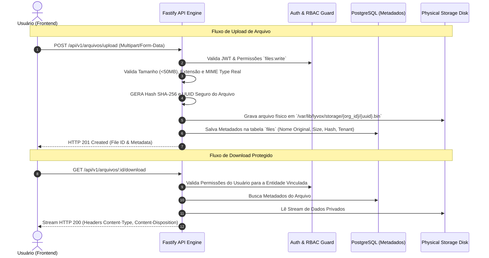

# 12 — Arquivos, Documentos e Storage

- **Documento ID:** DOC-12
- **Versão:** 1.0.0
- **Status:** APPROVED_BY_ARCHITECTURE_AGENT
- **Data:** 2026-07-21
- **Responsável:** Ottercraft (Storage & Data Security Architect)
- **Classificação:** ARCHITECTURAL_DECISION / USER_CONFIRMED
- **Documentos Dependentes:** [05-ARQUITETURA-GERAL-E-DECISOES-DE-STACK.md](file:///c:/Users/pedro/OneDrive/Documentos/00-Projetos/19-%20lyvoxcorp/docs/planejamento/05-ARQUITETURA-GERAL-E-DECISOES-DE-STACK.md), [07-ARQUITETURA-BACKEND.md](file:///c:/Users/pedro/OneDrive/Documentos/00-Projetos/19-%20lyvoxcorp/docs/planejamento/07-ARQUITETURA-BACKEND.md)
- **Fontes Consultadas:** PROMPT-MESTRE-OTTERCRAFT, OWASP File Upload Security Cheat Sheet

---

## 1. Arquitetura da Camada de Armazenamento

Em conformidade com a decisao de stack (ADR-012), o **Lyvox Gerenciamento** utiliza uma camada de **Armazenamento Privado Abstraído (*Abstracted Storage Driver*)**. Inicialmente, os arquivos residem em um volume montado criptografado na própria VPS (`/var/lib/lyvox/storage/`), expostos por uma interface de driver (`StorageDriver`) que permite migração transparente para MinIO ou S3 sem alteração do código da aplicação.

---

## 2. Fluxo Seguro de Upload e Download de Arquivos

---

## 3. Regras de Segurança Invioláveis no Tratamento de Arquivos

> [!CAUTION]
> **REGRAS RIGOROSAS DE ARMAZENAMENTO E SEGURANÇA:**
> 1. **Proibição de Exposição Estática Direta:** É estritamente proibido servir arquivos privados via diretório público do proxy (Caddy/Nginx). Todo acesso a arquivo passa obrigatoriamente pela API Fastify para validação de RBAC.
> 2. **Prevenção Total contra Path Traversal:** Nomes originais de arquivo fornecidos pelo usuário nunca são utilizados no caminho físico do sistema de arquivos. O nome do arquivo no disco é sempre um `UUIDv4` com extensão neutra ou binária.
> 3. **Validação de MIME Type Real (Magic Bytes):** A API inspeciona os primeiros bytes do buffer (Magic Numbers) para validar a verdadeira natureza do arquivo, descartando arquivos executáveis renomeados com extensões falsas.
> 4. **Tipos Permitidos:** `application/pdf`, `image/png`, `image/jpeg`, `image/webp`, `application/vnd.openxmlformats-officedocument.wordprocessingml.document` (DOCX), `application/vnd.openxmlformats-officedocument.spreadsheetml.sheet` (XLSX).
> 5. **Tipos Bloqueados:** `.exe`, `.bat`, `.sh`, `.php`, `.js`, `.py`, `.html`, `.svg` (previne SVG XSS).

---

## 4. Tabela de Metadados de Arquivo (`files`)

| Coluna | Tipo SQL | Constraints | Descrição |
|---|---|---|---|
| `id` | `UUID` | PK, NOT NULL | Identificador do arquivo |
| `organization_id` | `UUID` | FK, NOT NULL | Organização proprietária |
| `original_name` | `VARCHAR(255)` | NOT NULL | Nome original enviado pelo usuário |
| `storage_path` | `TEXT` | NOT NULL | Caminho físico interno isolado |
| `mime_type` | `VARCHAR(100)` | NOT NULL | MIME Type verificado via Magic Bytes |
| `size_bytes` | `BIGINT` | CHECK (>0), NOT NULL | Tamanho exato em bytes |
| `checksum_sha256` | `VARCHAR(64)` | NOT NULL | Hash SHA-256 para integridade |
| `entity_type` | `VARCHAR(50)` | NOT NULL | Entidade associada ('CLIENT', 'PROPOSAL', 'TASK') |
| `entity_id` | `UUID` | NOT NULL | ID do registro associado |
| `created_at` | `TIMESTAMPTZ` | DEFAULT NOW(), NOT NULL | Data do upload |
