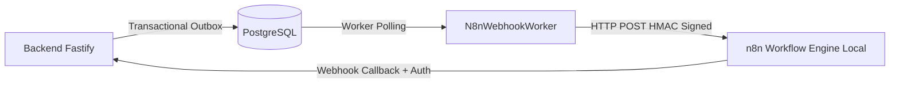

# 13 — Integrações: n8n, IA e Serviços Externos

- **Documento ID:** DOC-13
- **Versão:** 1.0.0
- **Status:** APPROVED_BY_ARCHITECTURE_AGENT
- **Data:** 2026-07-21
- **Responsável:** Ottercraft (Integrations & AI Architect)
- **Classificação:** ARCHITECTURAL_DECISION / USER_CONFIRMED
- **Documentos Dependentes:** [05-ARQUITETURA-GERAL-E-DECISOES-DE-STACK.md](file:///c:/Users/pedro/OneDrive/Documentos/00-Projetos/19-%20lyvoxcorp/docs/planejamento/05-ARQUITETURA-GERAL-E-DECISOES-DE-STACK.md), [11-CACHE-FILAS-WORKERS-E-JOBS.md](file:///c:/Users/pedro/OneDrive/Documentos/00-Projetos/19-%20lyvoxcorp/docs/planejamento/11-CACHE-FILAS-WORKERS-E-JOBS.md)
- **Fontes Consultadas:** PROMPT-MESTRE-OTTERCRAFT, n8n Official Documentation, Ollama API Spec

---

## 1. Integração com Engine de Automações Local (n8n)

O **n8n** é utilizado exclusivamente como orquestrador de fluxos externos e automações auxiliares de comunicação.

### 1.1 Regras de Governança Invioláveis para o n8n
> [!IMPORTANT]
> **REGRAS RIGOROSAS DO n8n:**
> 1. **Proibição de n8n como Fonte da Verdade:** O n8n nunca é o banco de dados mestre ou a fonte primária de verdade do sistema. Toda informação de negócio reside no PostgreSQL.
> 2. **Proibição de Regras Críticas em Workflows:** Regras de negócio essenciais (cálculos de parcelas, permissões RBAC, status de clientes) pertencem 100% ao backend Fastify.
> 3. **Assinatura HMAC de Webhooks:** Toda requisição entre a API Fastify e o n8n inclui o cabeçalho `X-Lyvox-Signature` contendo HMAC-SHA256 do payload assinado com segredo compartilhado.



---

## 2. Camada de Inteligência Artificial Assistida (Ollama AI Engine)

### 2.1 Abstração de Provedores de IA (`AiProvider`)
O sistema disponibiliza a interface `AiProvider` desacoplada:

```typescript
interface AiProvider {
  generateText(prompt: string, options?: AiOptions): Promise<string>;
  summarizeMeeting(transcript: string): Promise<MeetingSummary>;
  generateCopy(topic: string, channel: string): Promise<string>;
}
```

### 2.2 Provedor Principal: Ollama Self-Hosted
- **Instância:** Ollama v0.3+ rodando localmente na VPS em contêiner dedicado.
- **Modelos Homologados:** `llama3:8b-instruct-q4_K_M` (geração de texto), `mistral:7b-instruct` (análise de reuniões).
- **Operação Degradada Sem IA:** Se a instância do Ollama estiver indisponível ou estourar o timeout (30s), o sistema exibe aviso amigável ao usuário ("Serviço de IA temporariamente indisponível"), sem interromper o funcionamento de nenhum módulo básico (Clientes, Tarefas, Financeiro).

---

## 3. Matriz de Integrações Externas e Contratos

| Serviço Integrado | Finalidade | Tipo Conexão | Autenticação | Timeout | Retry / Fallback | Circuit Breaker |
|---|---|---|---|---:|---|:---:|
| **n8n Local** | Automations & Webhooks | HTTP REST | HMAC SHA-256 Header | 15s | 5x Exponential Backoff | Sim |
| **Ollama Local** | Copiloto & Resumos IA | HTTP REST | Internal Docker Net | 45s | 2x Retry / Fallback Aviso | Sim |
| **SMTP Server** | Envio de E-mails | TLS / SMTP | User / Password SASL | 10s | 3x BullMQ Queue Retry | Sim |
| **OpenAI (Opcional)**| Fallback de IA Externa | HTTPS REST | Bearer API Key | 20s | Direct Fallback to Ollama | Sim |
