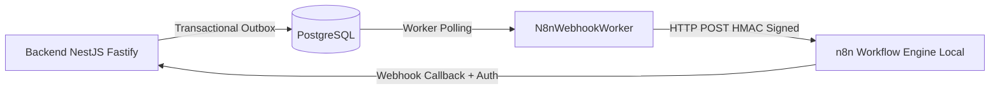

# 13 — Integrações: n8n, IA e Serviços Externos

- **Documento ID:** DOC-13
- **Versão:** 2.0.0
- **Status:** APPROVED_FOR_CODEX_IMPLEMENTATION
- **Data:** 2026-07-21
- **Responsável:** Ottercraft (Integrations & AI Architect)
- **Classificação:** USER_APPROVED_FOR_PLANNING / ARCHITECTURAL_DECISION
- **Documentos Dependentes:** [05-ARQUITETURA-GERAL-E-DECISOES-DE-STACK.md](./05-ARQUITETURA-GERAL-E-DECISOES-DE-STACK.md), [11-CACHE-FILAS-WORKERS-E-JOBS.md](./11-CACHE-FILAS-WORKERS-E-JOBS.md)
- **Fontes Consultadas:** PROMPT-FINAL-UNICO-OTTERCRAFT, n8n Official Documentation, Ollama API Spec

---

## 1. Integração com Engine de Automações Local (n8n)

O **n8n** é utilizado como orquestrador de fluxos externos e automações auxiliares.

### 1.1 Regras de Governança Invioláveis para o n8n
> [!IMPORTANT]
> **REGRAS RIGOROSAS DO n8n:**
> 1. **Proibição de n8n como Fonte da Verdade:** O n8n nunca é o banco de dados mestre ou a fonte primária de verdade. Toda informação de negócio reside no PostgreSQL.
> 2. **Proibição de Regras Críticas em Workflows:** Regras de negócio essenciais (cálculos de parcelas, permissões RBAC, status) pertencem 100% ao backend NestJS/Fastify.
> 3. **Assinatura HMAC de Webhooks:** Toda requisição entre a API e o n8n inclui o cabeçalho `X-Lyvox-Signature` contendo HMAC-SHA256 do payload assinado com segredo compartilhado.



---

## 2. Camada de Inteligência Artificial Assistida (Ollama AI Engine)

### 2.1 Abstração de Provedores de IA (`AiProvider`)
O sistema disponibiliza a interface `AiProvider` desacoplada:

```typescript
interface AiProvider {
  generateText(prompt: string, options?: AiOptions): Promise<string>;
  summarizeMeeting(transcript: string): Promise<MeetingSummary>;
  generateCopy(topic: string, channel: string): Promise<string>;
}
```

### 2.2 Provedor Principal: Ollama Self-Hosted
- **Instância:** Ollama rodando localmente na VPS em contêiner dedicado.
- **Modelos Homologados:** `llama3` (geração de texto), `mistral` (análise de reuniões).
- **Operação Degradada Sem IA (Sem Fallback Pago):** Caso o Ollama esteja indisponível ou estoure o timeout (30s), o sistema exibe um aviso ao usuário ("Serviço de IA temporariamente indisponível"). Não há fallback automático para APIs pagas. O sistema operacional continua 100% funcional.

---

## 3. Matriz de Integrações e Contratos

| Serviço Integrado | Finalidade | Tipo Conexão | Autenticação | Timeout | Retry / Fallback | Circuit Breaker |
|---|---|---|---|---:|---|:---:|
| **n8n Local** | Automations & Webhooks | HTTP REST | HMAC SHA-256 Header | 15s | 5x Exponential Backoff | Sim |
| **Ollama Local** | Copiloto & Resumos IA | HTTP REST | Internal Docker Net | 45s | 2x Retry / Operação Degradada | Sim |
| **SMTP Server** | Envio de E-mails | TLS / SMTP | User / Password SASL | 10s | 3x BullMQ Queue Retry | Sim |
