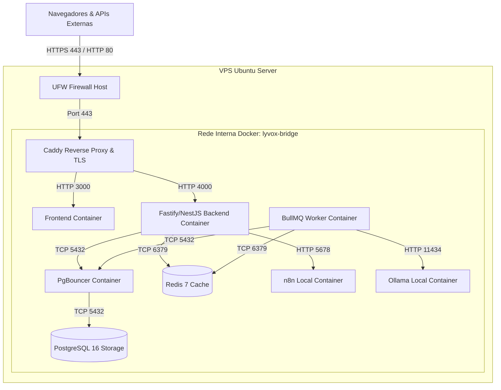

# 14 — Infraestrutura VPS, Rede e Deploy

- **Documento ID:** DOC-14
- **Versão:** 2.0.0
- **Status:** APPROVED_FOR_CODEX_IMPLEMENTATION
- **Data:** 2026-07-21
- **Responsável:** Ottercraft (DevOps & Infrastructure Architect)
- **Classificação:** USER_APPROVED_FOR_PLANNING / ARCHITECTURAL_DECISION
- **Documentos Dependentes:** [05-ARQUITETURA-GERAL-E-DECISOES-DE-STACK.md](./05-ARQUITETURA-GERAL-E-DECISOES-DE-STACK.md)
- **Fontes Consultadas:** PROMPT-FINAL-UNICO-OTTERCRAFT, Docker Compose v2 Docs, Caddy Documentation

---

## 1. Topologia de Infraestrutura VPS Self-Hosted

A plataforma **Lyvox Gerenciamento** opera em infraestrutura **Ubuntu Linux LTS** dedicada (16 vCPU, 62 GiB RAM de referência), utilizando **Docker Compose v2** para orquestração isolada de contêineres e **Caddy** como servidor web de borda e terminação TLS.

---

## 2. Hardening de Rede e Firewall (UFW)

### 2.1 Regras de Porta Exposta no Host
| Porta Host | Protocolo | Serviço | Exposição Externa | Justificativa |
|---|---|---|---|---|
| `22` | TCP | SSH (Chave Pública Apenas) | Restrita (IP Admin) | Administração remota do servidor |
| `80` | TCP | HTTP Caddy | Pública | Redirecionamento automático HTTP -> HTTPS |
| `443` | TCP | HTTPS Caddy | Pública | Tráfego seguro web criptografado TLS 1.3 |
| `5432` | TCP | PostgreSQL | **BLOQUEADA** | Acesso restrito à rede interna Docker |
| `6379` | TCP | Redis | **BLOQUEADA** | Acesso restrito à rede interna Docker |
| `4000` | TCP | NestJS/Fastify Backend | **BLOQUEADA** | Acesso apenas via proxy Caddy |

---

## 3. Orçamento de Recursos e Memória (Resource Budget)

O orçamento de recursos é estruturado para garantir que a soma dos serviços mantidos no host respeite a margem do sistema operacional (12 GiB):

- **Consumo Total Planejado dos Serviços:** 41 GiB
- **Margem de SO & Page Cache:** 12 GiB
- **Alocação Total Planejada:** 53 GiB (Dentro do limite de 62 GiB RAM da VPS)

---

## 4. Estratégia de Deploy Controlado (Controlled Deployment Window)

O procedimento de publicação de novas versões no ambiente de produção adota a estratégia de **Janela Controlada de Atualização com Backup Prévio**:

1. **Notificação & Bloqueio:** Ativação da tela de manutenção `/maintenance` via Caddy.
2. **Backup Prévio Obrigatório:** Execução de backup completo do PostgreSQL via `pgBackRest` antes de qualquer alteração de código ou banco.
3. **Migrations com Padrão Expand & Contract:** Aplicação das migrations de banco de dados no contêiner de pré-deploy.
4. **Atualização de Imagens Docker:** Atualização dos contêineres para as novas imagens imutáveis geradas pelo GitHub Actions (`GHCR`).
5. **Graceful Shutdown & Restart:** Encerramento gracioso dos contêineres antigos (15s) e inicialização da nova versão.
6. **Validação e Reabertura:** Execução de testes de fumaça (*Smoke Tests* em `/health`) e reabertura do tráfego.
