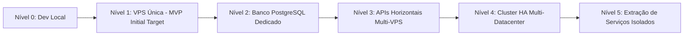

# 16 — Performance, Capacidade e Escalabilidade

- **Documento ID:** DOC-16
- **Versão:** 2.0.0
- **Status:** APPROVED_FOR_CODEX_IMPLEMENTATION
- **Data:** 2026-07-21
- **Responsável:** Ottercraft (Performance & Capacity Engineer)
- **Classificação:** USER_APPROVED_FOR_PLANNING / ARCHITECTURAL_DECISION
- **Documentos Dependentes:** [05-ARQUITETURA-GERAL-E-DECISOES-DE-STACK.md](./05-ARQUITETURA-GERAL-E-DECISOES-DE-STACK.md), [08-MODELAGEM-POSTGRESQL-E-DICIONARIO-DE-DADOS.md](./08-MODELAGEM-POSTGRESQL-E-DICIONARIO-DE-DADOS.md)
- **Fontes Consultadas:** PROMPT-FINAL-UNICO-OTTERCRAFT, k6 Performance Testing Documentation

---

## 1. Metas de Capacidade e Performance de Referência

O dimensionamento inicial do **Lyvox Gerenciamento** contempla o seguinte perfil de referência para testes de carga em produção:

- **Usuários Cadastrados de Referência:** Atendimento a até **10.000 usuários**.
- **Sessões Concorrentes de Referência:** Suporte sustentado para **500 sessões simultâneas** ativas.
- **Throughput Sustentado de Referência:** Capacidade para processar **100 requisições HTTP/segundo (RPS)**.

---

## 2. Metas de Latência e Limites de Execução (USER_APPROVED_FOR_PLANNING)

| Métrica / Operação | Latência P50 | Latência P95 Alvo | Latência P99 | Limite Máximo Tolerado |
|---|---:|---:|---:|---:|
| **Rotas de Leitura Comun (GET)** | 50ms | **250ms** | 500ms | 1200ms |
| **Rotas de Escrita Comun (POST/PUT)**| 120ms | **500ms** | 900ms | 2000ms |
| **Consultas SQL no PostgreSQL** | 5ms | **100ms** | 250ms | 500ms |
| **Geração de PDF (Background Job)**| 2.0s | **5.0s** | 10.0s | 20.0s |

---

## 3. Cenários de Teste de Carga Automatizados com k6

A suíte de testes de carga via **k6** avalia a estabilidade da aplicação sob os seguintes cenários simulados:

1. **Autenticação Concorrente:** Teste de login simultâneo gerando sessões opacas e validando cookies.
2. **Carga em Dashboard:** Requisições GET concorrentes no endpoint `/api/v1/dashboard/kpis` testando o cache em Redis.
3. **Listagem e Busca de Clientes:** Consultas paginadas por cursor com filtros textuais.
4. **Mutação em Pipeline CRM:** Transição de etapas Kanban acionando eventos de outbox.
5. **Escrita Financeira Transacional:** Lançamentos financeiros com trava de concorrência (`version`) e idempotência.

---

## 4. Níveis Estratégicos de Escalabilidade (Escalation Levels)

A arquitetura prevê 6 níveis evolutivos de escalabilidade. A transição entre níveis é acionada por gatilhos objetivos de capacidade:

### Detalhamento dos Níveis de Escala

| Nível | Nível de Arquitetura | Gatilho de Mudança | Alteração Principal | Custo Operacional |
|---|---|---|---|---|
| **Nível 0** | Dev Local | Início do projeto | Ambiente Docker Compose em máquina local de desenvolvimento. | Baixo |
| **Nível 1** | **VPS Única (Alvo Inicial)** | Lançamento MVP Lyvox | Todos os serviços (Proxy, Web, API, DB, Redis, Workers) em 1 VPS de 62GB RAM. | Base |
| **Nível 2** | Banco Dedicado | CPU DB > 70% constante | Migração do PostgreSQL/PgBouncer para uma segunda VPS dedicada. | + 100% |
| **Nível 3** | APIs Horizontais | Throughput > 300 RPS | Multiplicação de instâncias da API em múltiplas VPSs atrás de Load Balancer. | + 200% |
| **Nível 4** | HA Multi-VPS | Exigência de HA | Cluster PostgreSQL Patroni ativo/passivo e Redis Sentinel. | + 400% |
| **Nível 5** | Extração de Serviços | > 50.000 Usuários | Extração de domínios pesados (ex: IA / Filas) em microserviços isolados. | Alto |
