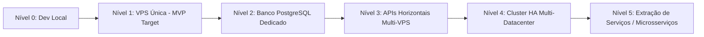

# 16 — Performance, Capacidade e Escalabilidade

- **Documento ID:** DOC-16
- **Versão:** 1.0.0
- **Status:** APPROVED_BY_ARCHITECTURE_AGENT
- **Data:** 2026-07-21
- **Responsável:** Ottercraft (Performance & Capacity Engineer)
- **Classificação:** ARCHITECTURAL_DECISION / USER_CONFIRMED
- **Documentos Dependentes:** [05-ARQUITETURA-GERAL-E-DECISOES-DE-STACK.md](file:///c:/Users/pedro/OneDrive/Documentos/00-Projetos/19-%20lyvoxcorp/docs/planejamento/05-ARQUITETURA-GERAL-E-DECISOES-DE-STACK.md), [08-MODELAGEM-POSTGRESQL-E-DICIONARIO-DE-DADOS.md](file:///c:/Users/pedro/OneDrive/Documentos/00-Projetos/19-%20lyvoxcorp/docs/planejamento/08-MODELAGEM-POSTGRESQL-E-DICIONARIO-DE-DADOS.md)
- **Fontes Consultadas:** PROMPT-MESTRE-OTTERCRAFT, k6 Performance Testing Documentation

---

## 1. Metas de Capacidade e Performance de Referência

O dimensionamento inicial do **Lyvox Gerenciamento** contempla o seguinte perfil de carga de referência no ambiente de produção:

- **Usuários Cadastrados:** Atendimento confortável a até **10.000 usuários**.
- **Sessões Concorrentes:** Suporte sustentado para **500 sessões simultâneas** ativas.
- **Throughput Sustentado:** Capacidade para processar **100 requisições HTTP/segundo (RPS)** mantendo latência P95 abaixo de 200ms.

---

## 2. Metas de Latência e Limites de Execução

| Métrica / Operação | Latência P50 | Latência P95 | Latência P99 | Limite Máximo Tolerado |
|---|---:|---:|---:|---:|
| **Rotas de Leitura API (GET)** | 30ms | 150ms | 300ms | 1000ms |
| **Rotas de Escrita API (POST/PUT)**| 80ms | 350ms | 700ms | 2000ms |
| **Consultas SQL Simples** | 2ms | 15ms | 50ms | 200ms |
| **Geração de PDF (Background Job)**| 1.5s | 4.0s | 8.0s | 15.0s |

---

## 3. Níveis Estratégicos de Escalabilidade (Escalation Levels)

A arquitetura prevê 6 níveis evolutivos de escalabilidade. A transição entre níveis é acionada por gatilhos objetivos de capacidade:

### Detalhamento dos Níveis de Escala

| Nível | Nível de Arquitetura | Gatilho de Mudança | Alteração Principal | Custo Operacional |
|---|---|---|---|---|
| **Nível 0** | Dev Local | Início do projeto | Ambiente Docker Compose em máquina local de desenvolvimento. | Baixo |
| **Nível 1** | **VPS Única (Alvo Inicial)** | MVP / Lançamento | Todos os serviços (Proxy, Web, API, DB, Redis, Workers) em 1 VPS de 62GB RAM. | Base |
| **Nível 2** | Banco Dedicado | CPU DB > 70% constante | Migração do PostgreSQL/PgBouncer para uma segunda VPS exclusiva com SSD NVMe. | + 100% |
| **Nível 3** | APIs Horizontais | Throughput > 300 RPS | Multiplicação dos contêineres de API Fastify em 2 ou 3 VPSs atrás de Load Balancer. | + 200% |
| **Nível 4** | HA Multi-VPS | Exigência de HA | Cluster PostgreSQL Patroni ativo/passivo e Redis Sentinel em múltiplos nós. | + 400% |
| **Nível 5** | Extração de Serviços | > 50.000 Usuários | Extração de domínios pesados (ex: IA / Filas) em microserviços isolados. | Alto |
