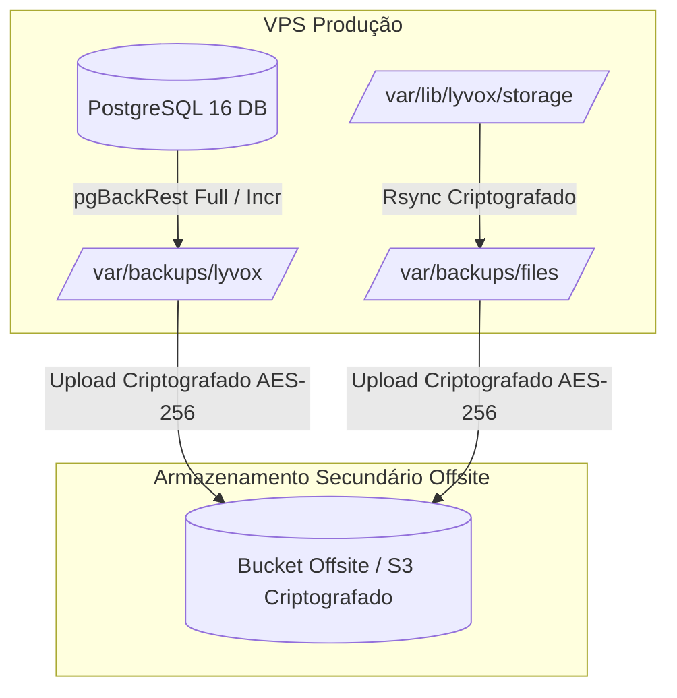

# 19 — Backup, Restore, DR e Continuidade

- **Documento ID:** DOC-19
- **Versão:** 1.0.0
- **Status:** APPROVED_BY_ARCHITECTURE_AGENT
- **Data:** 2026-07-21
- **Responsável:** Ottercraft (SRE & Disaster Recovery Specialist)
- **Classificação:** ARCHITECTURAL_DECISION / USER_CONFIRMED
- **Documentos Dependentes:** [05-ARQUITETURA-GERAL-E-DECISOES-DE-STACK.md](file:///c:/Users/pedro/OneDrive/Documentos/00-Projetos/19-%20lyvoxcorp/docs/planejamento/05-ARQUITETURA-GERAL-E-DECISOES-DE-STACK.md), [14-INFRAESTRUTURA-VPS-REDE-E-DEPLOY.md](file:///c:/Users/pedro/OneDrive/Documentos/00-Projetos/19-%20lyvoxcorp/docs/planejamento/14-INFRAESTRUTURA-VPS-REDE-E-DEPLOY.md)
- **Fontes Consultadas:** PROMPT-MESTRE-OTTERCRAFT, pgBackRest Manual, PostgreSQL Disaster Recovery Guide

---

## 1. Declaração Fundamental sobre Disaster Recovery

> [!CAUTION]
> **PRINCÍPIO INVIOLÁVEL DE DISASTER RECOVERY (DR):**
> **BACKUP NO MESMO HOST NÃO É DISASTER RECOVERY.**
> 
> Arquivos de backup armazenados exclusivamente no mesmo disco rígido ou no mesmo servidor VPS onde a aplicação roda **não oferecem proteção real** contra falha de hardware, destruição de disco, comprometimento do sistema por ransomware ou exclusão acidental da máquina pelo provedor. Todos os backups do **Lyvox Gerenciamento** são obrigatoriamente criptografados e transferidos para um **Armazenamento Offsite Isolado** (Servidor Secundário ou Bucket S3/B2 criptografado).

---

## 2. Metas de Continuidade de Negócio (RPO e RTO)

- **Recovery Point Objective (RPO):** **MÁXIMO DE 1 HORA**. Em caso de desastre total, a perda máxima de dados aceitável é de 1 hora de transações (garantida via replicação contínua de logs WAL do PostgreSQL).
- **Recovery Time Objective (RTO):** **MÁXIMO DE 4 HORAS**. Tempo total para provisionamento de uma nova VPS, instalação dos contêineres e restore completo da base de dados e arquivos.

---

## 3. Estratégia e Rotina de Backups



### 3.1 Tabela de Frequência e Retenção de Backups

| Tipo de Backup | Frequência | Ferramenta | Criptografia | Retenção Local | Retenção Offsite |
|---|---|---|---|---|---|
| **PostgreSQL Full** | Diário (02:00h) | `pgBackRest` / `pg_dump` | AES-256 | 7 dias | 30 dias |
| **PostgreSQL WAL / Incremental**| A cada 1 hora | `pgBackRest` WAL Archiving | AES-256 | 24 horas | 7 dias |
| **Arquivos Privados (Storage)**| Diário (03:00h) | `restic` / `rsync` | AES-256 | 3 dias | 30 dias |
| **Configurações e Env Schema** | Semanal | Dump de Configuração | AES-256 | 30 dias | 90 dias |

---

## 4. Runbook Detalhado de Restauração de Desastre (Restore Runbook)

### 4.1 Cenário: Perda Total da VPS Principal (Perda de Host)

1. **Passo 1 — Provisionamento da Nova VPS:** Criar nova instância VPS Ubuntu Server no provedor e instalar Docker Compose v2 e UFW Firewall.
2. **Passo 2 — Obtenção dos Certificados e Chaves de Criptografia:** Importar as chaves GPG/AES salvas no cofre de segredos corporativo.
3. **Passo 3 — Download do Backup Offsite:** Baixar o último backup Full do PostgreSQL e o acervo de arquivos privados do bucket offsite:
   ```bash
   aws s3 cp s3://lyvox-offsite-backups/postgres/latest-full.tar.gz.enc ./
   openssl enc -d -aes-256-cbc -pbkdf2 -in latest-full.tar.gz.enc | tar -xz -C /tmp/restore/
   ```
4. **Passo 4 — Restauração da Base PostgreSQL:** Subir o contêiner temporário de restore do PostgreSQL e executar a restauração de dados:
   ```bash
   docker exec -i lyvox-postgres pg_restore -U lyvox_app -d lyvox_db /tmp/restore/dump.pgdump
   ```
5. **Passo 5 — Restauração do Storage de Arquivos:** Descompactar o acervo de arquivos privados no diretório `/var/lib/lyvox/storage/`.
6. **Passo 6 — Subida dos Contêineres da Aplicação:** Executar `docker compose up -d` e validar os endpoints de healthcheck (`/health` e `/readiness`).
7. **Passo 7 — Validação e Troca de DNS:** Realizar login administrativo, conferir a integridade dos dados e atualizar os apontamentos de DNS para o novo IP da VPS.
