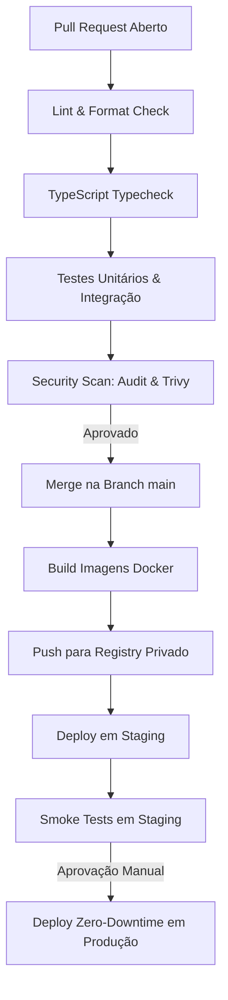

# 20 — CI/CD, Versionamento, Release e Rollback

- **Documento ID:** DOC-20
- **Versão:** 1.0.0
- **Status:** APPROVED_BY_ARCHITECTURE_AGENT
- **Data:** 2026-07-21
- **Responsável:** Ottercraft (DevOps & Release Engineer)
- **Classificação:** ARCHITECTURAL_DECISION / USER_CONFIRMED
- **Documentos Dependentes:** [05-ARQUITETURA-GERAL-E-DECISOES-DE-STACK.md](file:///c:/Users/pedro/OneDrive/Documentos/00-Projetos/19-%20lyvoxcorp/docs/planejamento/05-ARQUITETURA-GERAL-E-DECISOES-DE-STACK.md), [14-INFRAESTRUTURA-VPS-REDE-E-DEPLOY.md](file:///c:/Users/pedro/OneDrive/Documentos/00-Projetos/19-%20lyvoxcorp/docs/planejamento/14-INFRAESTRUTURA-VPS-REDE-E-DEPLOY.md)
- **Fontes Consultadas:** PROMPT-MESTRE-OTTERCRAFT, GitHub Actions Documentation, Semantic Versioning 2.0.0 Spec

---

## 1. Estratégia de Branches e Versionamento Semântico

O projeto adota o fluxo **GitHub Flow com Release Branches**, associado a **Conventional Commits** e **Semantic Versioning (SemVer 2.0.0)** (`MAJOR.MINOR.PATCH`).

### 1.1 Regras de Branches
- **`main`:** Código de produção. Qualquer commit na `main` representa uma versão estável e implantável.
- **`feature/<nome-da-feature>`:** Branches de trabalho para novos requisitos.
- **`fix/<nome-do-bug>`:** Branches para correção de bugs.
- **`release/vX.Y.Z`:** Branch de preparação e validação de versão.

---

## 2. Pipeline de CI/CD (GitHub Actions Workflow)



---

## 3. Compatibilidade de Migrations (Padrão Expand & Contract)

Para garantir que deploys e rollbacks ocorram sem quebra de indisponibilidade ou falhas em contêineres ativos, todas as alterações de esquema de banco de dados devem obrigatoriamente seguir a estratégia de 3 fases:

1. **Fase 1 (Expand):** Adicionar colunas ou tabelas novas como nulas (`NULL`) ou com valor padrão. O código antigo continua funcionando normalmente sem conhecer o novo esquema.
2. **Fase 2 (Migrate):** Publicar a nova versão do aplicativo que lê e escreve no novo esquema.
3. **Fase 3 (Contract):** Em uma release futura (após confirmação de estabilidade), remover colunas ou tabelas legadas que não são mais utilizadas.

---

## 4. Runbook de Rollback de Emergência

### 4.1 Cenário: Falha Grave Detectada Pós-Deploy em Produção

1. **Passo 1 — Reversão de Tráfego Proxy (Caddy Reload):** Redirecionar imediatamente o tráfego do proxy Caddy para a versão anterior do contêiner (`backend-blue`):
   ```bash
   docker exec -it caddy caddy reload --config /etc/caddy/Caddyfile.previous
   ```
2. **Passo 2 — Reversão de Imagem Docker:** Reverter as variáveis de tag no `docker-compose.yml` para a versão anterior homologada (`:v1.0.4`).
3. **Passo 3 — Truncamento/Rollback de Migrations se Necessário:** Se a migration seguiu o padrão *Expand*, nenhuma reversão de banco é necessária. Caso contrário, executar a migration de rollback correspondente.
4. **Passo 4 — Smoke Test de Validação:** Acessar a aplicação e validar a restauração do funcionamento normal.
