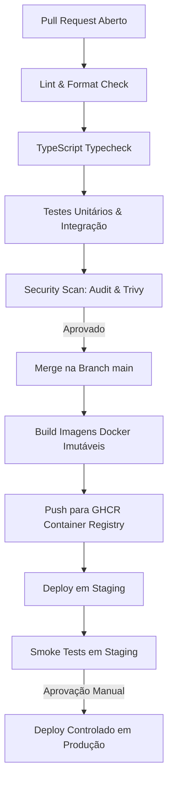

# 20 — CI/CD, Versionamento, Release e Rollback

- **Documento ID:** DOC-20
- **Versão:** 2.0.0
- **Status:** APPROVED_FOR_CODEX_IMPLEMENTATION
- **Data:** 2026-07-21
- **Responsável:** Ottercraft (DevOps & Release Engineer)
- **Classificação:** USER_APPROVED_FOR_PLANNING / ARCHITECTURAL_DECISION
- **Documentos Dependentes:** [05-ARQUITETURA-GERAL-E-DECISOES-DE-STACK.md](./05-ARQUITETURA-GERAL-E-DECISOES-DE-STACK.md), [14-INFRAESTRUTURA-VPS-REDE-E-DEPLOY.md](./14-INFRAESTRUTURA-VPS-REDE-E-DEPLOY.md)
- **Fontes Consultadas:** PROMPT-FINAL-UNICO-OTTERCRAFT, GitHub Actions Documentation, Semantic Versioning 2.0.0 Spec

---

## 1. Estratégia de Branches e Versionamento Semântico

O projeto adota o fluxo **GitHub Flow com Release Branches**, associado a **Conventional Commits** e **Semantic Versioning (SemVer 2.0.0)** (`MAJOR.MINOR.PATCH`).

### 1.1 Regras de Branches
- **`main`:** Código de produção. Qualquer commit na `main` representa uma versão estável.
- **`feature/<nome-da-feature>`:** Branches de trabalho para novos requisitos.
- **`fix/<nome-do-bug>`:** Branches para correção de bugs.
- **`release/vX.Y.Z`:** Branch de preparação e validação de versão.

---

## 2. Pipeline de CI/CD (GitHub Actions Workflow)

---

## 3. Compatibilidade de Migrations (Padrão Expand & Contract)

Todas as alterações de esquema de banco de dados devem obrigatoriamente seguir a estratégia de 3 fases:

1. **Fase 1 (Expand):** Adicionar colunas ou tabelas novas como nulas (`NULL`) ou com valor padrão. O código antigo continua funcionando normalmente.
2. **Fase 2 (Migrate):** Publicar a nova versão da aplicação que lê e escreve no novo esquema.
3. **Fase 3 (Contract):** Em uma release futura, remover colunas ou tabelas legadas.

---

## 4. Runbook de Rollback de Emergência

### 4.1 Cenário: Falha Grave Detectada Pós-Deploy em Produção
1. **Passo 1 — Ativação de Tela de Manutenção:** Ativar `/maintenance` no proxy Caddy.
2. **Passo 2 — Reversão de Imagem Docker:** Reverter as variáveis de tag no `docker-compose.yml` para a versão anterior homologada (`:v1.0.4`).
3. **Passo 3 — Verificação de Migrations:** Caso a migration seguiu o padrão *Expand*, nenhuma reversão de banco é necessária. Caso contrário, executar a migration de rollback correspondente.
4. **Passo 4 — Smoke Test & Reabertura:** Subir contêineres e validar a restauração em `/health`.
